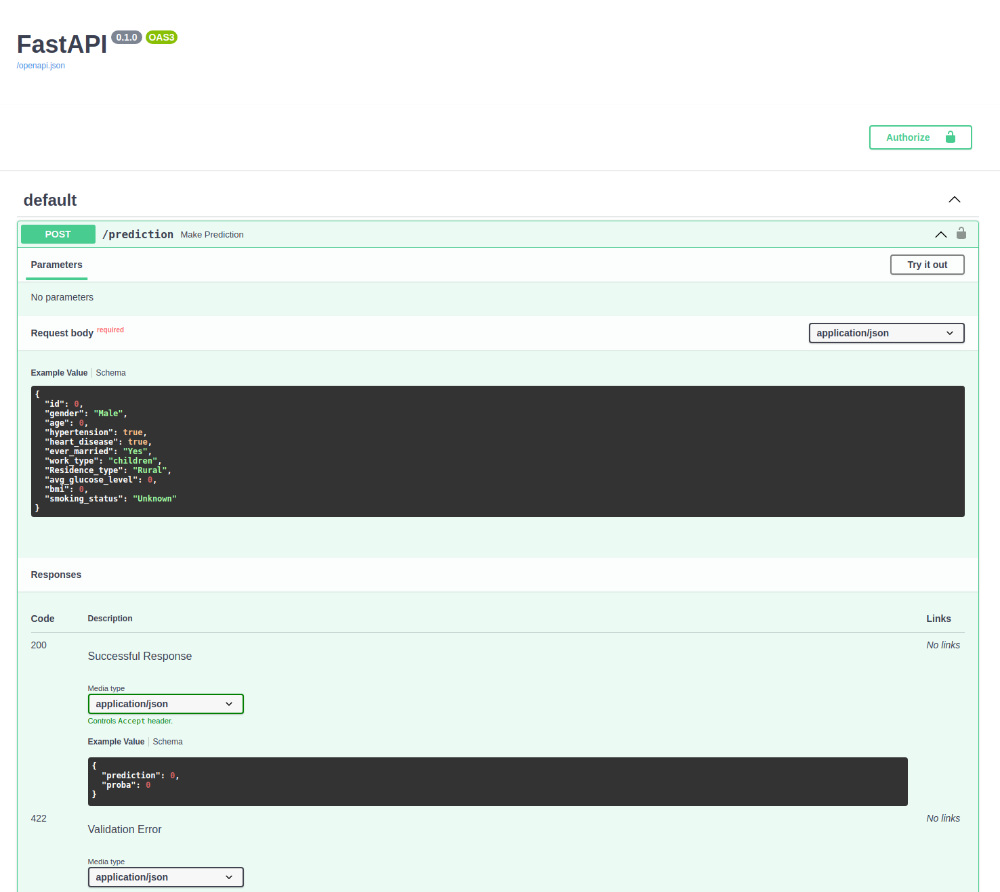
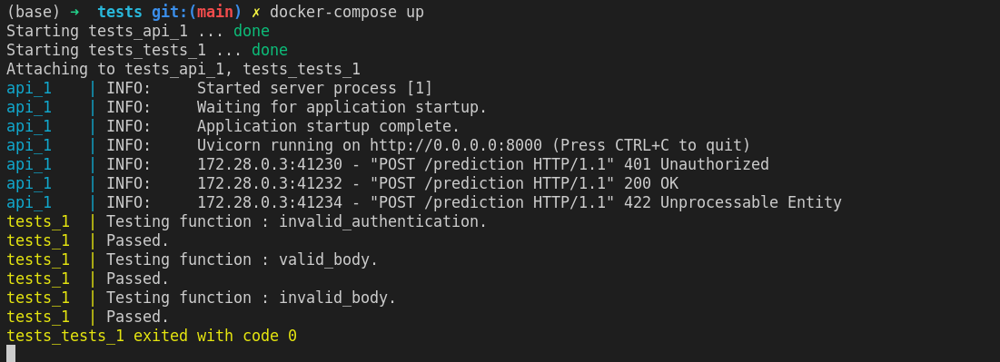

# Projet Data Engineering stroke

Le but de ce projet est de développer et déployer une API permettant de prédire la probabilité d'occurrence d'un AVC (*stroke*).

Il se compose des éléments suivants :

- Un [script](./training/train.py) d'entrainement du modèle de machine learning.
- Une [api](./api), développée avec le framework [FastAPI](https://fastapi.tiangolo.com/).


## Machine Learning

Pour lancer l'entrainement du modèle de machine learning placez vous dans le dossier `training`, installez les dépendances (dans un environnement virtuel dédié), puis exécutez le script [train.py](./training/train.py):

```
cd training
pip install -r requirements.txt
python train.py
```

Le script train.py entraine un [GradientBoostingClassifier](https://scikit-learn.org/stable/modules/generated/sklearn.ensemble.GradientBoostingClassifier.html), affiche les métriques ([classifcation_report](https://scikit-learn.org/stable/modules/generated/sklearn.metrics.classification_report.html), [confusion_matrix](https://scikit-learn.org/stable/modules/generated/sklearn.metrics.confusion_matrix.html), [f1_score](https://scikit-learn.org/stable/modules/generated/sklearn.metrics.f1_score.html#sklearn.metrics.f1_score)) sur les ensembles de train et de test, et enregistre (dans le dossier data) le modèle entrainé au format [pickle](https://docs.python.org/3/library/pickle.html) ([model.pkl](./training/data/model.pkl)) ainsi que les métriques associées ([scores.txt](./training/data/scores.txt)).


## API

Après avoir entrainé le modèle de ML, nous souhaitons développer une API HTTP permettant d'interagir avec le modèle afin d'obtenir une prédiction à partir des features.

Cette API est développée avec le framework [FastAPI](https://fastapi.tiangolo.com/) dans le dossier [api](./api). Elle est composée des fichiers suivants :

- [main.py](./api/main.py): fichier principal, qui définit la route de prediction `POST /prediction`.
- [models.py](./api/models.py) : définit les modèles de données attendus en entrée et sortie de l'API.
- [users.json](./api/users.json) : liste des *username* / *password* pour l'authentification.
- [data_preparation.py](./api/data_preparation.py) : Définit la fonction `prepare_data`, qui permet de préparer les données pour la prédiction par le modèle de ML à partir des informations transmises dans le corps de la requête `POST /prediction`.
- [data/model.pkl](./data/model.pkl) : le modèle de ML entrainé, au format pickle.
- [requirements.txt](./api/requirements.txt) : dépendances Python.


Le modèle est chargée au lancement de l'API :

```python
with open("./data/model.pkl", "rb") as f:
    model = pickle.load(f)
```

Et est utilisé au moment d'une requête `POST /endpoint` pour faire la prédiction à partir des features :

```python
@api.post("/prediction", response_model=Prediction)
def make_prediction(
    data: Features, credentials: HTTPBasicCredentials = Depends(security)
):

    if not check_credentials(credentials):
        raise HTTPException(
            status_code=status.HTTP_401_UNAUTHORIZED,
            detail="Incorrect email or password",
            headers={"WWW-Authenticate": "Basic"},
        )

    df = prepare_data(data)

    proba = round(model.predict_proba(df)[0][1], 4)
    prediction = int(model.predict(df)[0])

    return {"prediction": prediction, "proba": proba}
```


Pour lancer l'API, exécutez les commandes suivantes :

```
cd api
pip install -r requirements.txt
uvicorn main:api
```

L'API est désormais accessible à l'adresse `localhost:8000`.

En particulier, vous pouvez accéder à la documentation de l'API à l'adresse [localhost:8000/docs](http://localhost:8000/docs) :



**Docker :**

Vous pouvez également lancer l'API avec Docker, en *buildant* préalablement l'image Docker définie dans le [Dockerfile](./api/Dockerfile):

```
cd api
docker build -t stroke-api .
docker run -p 8000:8000 --rm stroke-api
```

L'API sera accessible à l'adresse `localhost:8000`.


## Tests

Afin de s'assurer facilement que l'API est fonctionnelle, nous avons développé une série de tests dans le dossier [tests](./tests).

Ces tests permettent notamment de s'assurer que :

- L'authentification est fonctionnelle. C'est à dire qu'une requête envoyée sans *credentials* ou avec des *credentials* erronés renverra une erreur 401.
- La validation du schéma est fonctionnelle. C'est à dire  qu'une requête dont le corps n'est pas conforme au schéma attendu renverra une erreur 422.


Pour lancer les tests, après avoir lancé l'API en local, placez vous dans le dossier tests, installé les dépendances (dans une environnement virtuel dédié), et exécutez le fichier [main.py](./tests/main.py) :

```
cd tests
pip install -r requirements.txt
python main.py
```

**Docker compose :**

Vous pouvez également lancez l'API et les tests directement grâce à [docker-compose](https://docs.docker.com/compose/) :

```
cd tests
docker-compose up --build
```


